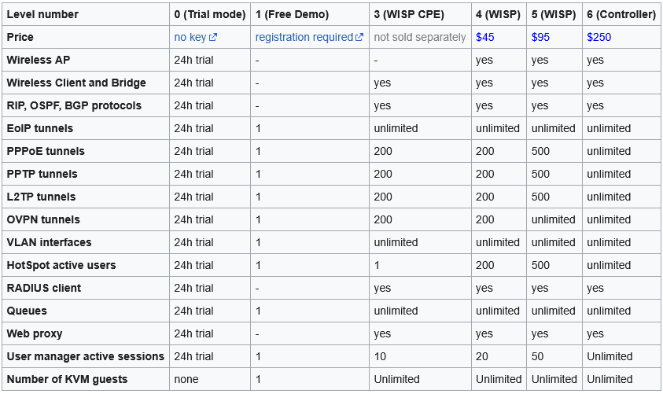

# LAB-14-Lisensi-router-os-
tanggal 14 agustus 2025
# Lisensi RouterOs 
Lisensi RouterOS adalah sistem perizinan yang digunakan oleh MikroTik untuk mengatur fitur, fungsi,  
dan kemampuan sistem operasi RouterOS berdasarkan level tertentu. Lisensi ini diperlukan agar RouterOS  
dapat digunakan secara penuh dan permanen setelah instalasi. Pada RouterOS Lisensi dibedakan menjadi enam.  

**Berikut adalah penjelasan detail dari masing-masing level:**  

        Level 0 (Trial mode): Merupakan mode uji coba yang aktif selama 24 jam setelah instalasi. Setelah itu,  
                              pengguna harus mengaktifkan lisensi lain atau membeli lisensi baru.   
        Level 1 (Free Demo): Level ini memberikan fungsi routing standar dengan satu pengaturan. Tidak ada batasan waktu penggunaan,   
                             tetapi fiturnya terbatas.   
        Level 3 (WISP CPE): Lisensi ini dijual terpisah karna biasanya sudah terpasang pada perangkat Mikrotik tertentu yang digunakan    
                            sebagai Customer Premises Equipment (CPE) atau perangkat station. Dimana perangkat dengan level 3 ini     
                            tidak dapat menjadi AP dan hanya bisa menerima sinyal (station). Level ini mencakup fitur level 1 dan    
                            menambahkan kemampuan untuk mengelola perangkat keras berbasis Ethernet dan perangkat wireless tipe klien (CPE).  
        Level 4 (WISP): Mencakup fitur level 1 dan 3, serta menambahkan kemampuan untuk mengelola perangkat wireless tipe akses poin.   
        Level 5 (WISP): Mencakup fitur level 1, 3, dan 4, serta menambahkan kemampuan untuk mengelola jumlah pengguna hotspot yang lebih banyak.   
        Level 6 (Controller): Mencakup semua fitur dan tidak memiliki batasan apapun, merupakan level tertinggi dalam RouterOS.   

**DETAIL GAMBAR**

# kesimpulan
Lisensi MikroTik adalah sistem perizinan yang digunakan untuk mengatur fitur dan kapasitas perangkat RouterOS.  
Setiap level lisensi (dari Level 0 hingga Level 6) memberikan akses ke fungsi dan batasan tertentu,  
seperti jumlah pengguna, durasi penggunaan, dan fitur jaringan lanjutan.
